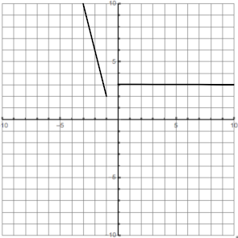
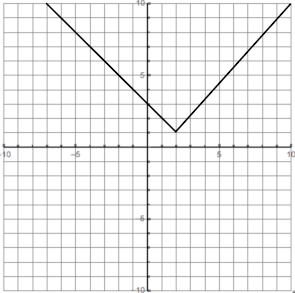

- (Describing Limits) As $x$ approaches $3$, $x^2$ approaches $9$
  $$\lim_{x \to 3}{x^2 = 9}$$
- (Common Use) Values that are undefined can still have limits, given a graph $G$ where $f(3) = \text{undefined}$ ($f(3)$ is a hole), the following limit is valid:
  $$\lim_{x \to 3}{f(x) = 4}$$
- Calculating Limits Numerically:
	- $f(x) = \frac{x^3-1}{x-1}$
	    
	  |0.9 |0.99  |0.999   |0.9999    |
	  |----|------|--------|----------|
	  |2.71|2.9701|2.997001|2.99970001|
	  
	  |1.1 |1.01  |1.001   |1.0001    |
	  |----|------|--------|----------|
	  |3.31|3.0301|3.003001|3.00030001|
	    
	  As $x$ approaches $1$, $f(x)$ approaches $3$: $\lim\limits_{x \to 1}{\frac{x^3-1}{x-1}} = 3$
- Calculating One-sided limits:
	- $g(x) = \frac{x^3 - 4x}{8|x-2|}$
	  
	  |1.9     |1.99      |1.999       |1.9999       |
	  |--------|----------|------------|-------------|
	  |−0.92625|−0.9925125|−0.999250125|−0.9999250013|
	  
	  |2.1    |2.01     |2.001      |2.0001     |
	  |-------|---------|-----------|-----------|
	  |1.07625|1.0075125|1.000750125|1.000075001|
	  
	  $$\lim_{x \to 2}{g(x)} = \text{Does not exist}$$
	  $$\lim_{x \to 2^-}{g(x)} = -1$$
	  $$\lim_{x \to 2^+}{g(x)} = 1$$
- Calculating piecewise function limits
	- $f(x) = \begin{cases}3 - x \text{ if } x < 2 \\ x - 1 \text{ if } x > 2 \end{cases}$
	  $a = 2$
	  
	  |1.9|1.99|1.999|1.9999|
	  |---|----|-----|------|
	  |1.1|1.01|1.001|1.0001|
	  
	  |2.1|2.01|2.001|2.0001|
	  |---|----|-----|------|
	  |1.1|1.01|1.001|1.0001|
	  
	  Explanation: Since $f(2)$ is not defined within the piece wise function, a graph representing this function would have a whole where $x = a$ and have two lines with inverse slopes
	      
	  $$f(a) = \text{undefined}$$
	  $$\lim_{x \to a}{f(x)} = 1$$
	  $$\lim_{x \to a^-}{f(x)} = 1$$
	  $$\lim_{x \to a^+}{f(x)} = 1$$
- Limit Laws
	- Problem 1:
		- Definitions:
		  $\lim\limits_{x \to 3}{f(x)} = 2$
		  $\lim\limits_{x \to 3}{g(x)} = -1$
		  $\lim\limits_{x \to 3}{h(x)} = 6$
		- Problems:
			- Sub-Problem 1: Sum, Constant Multiple
			  $$\begin{eqnarray}
			  \lim_{x \to 3}{(f(x) + 2g(x))} &=& \lim_{x \to 3}{f(x)} + \lim_{x \to 3}{2g(x)} \\
			  &=& \lim_{x \to 3}{f(x)} + 2(\lim_{x \to 3}{g(x)}) \\
			  &=& 2 + 2(-1) \\
			  &=& 0 \\
			  \end{eqnarray}$$
			- Sub-Problem 2: Quotient
			  $$\begin{eqnarray}
			  \lim_{x \to 3}{\frac{h(x)}{g(x)}} &=& \frac{\lim\limits_{x \to 3}{h(x)}}{\lim\limits_{x \to 3}{g(x)}} \\
			  &=& \frac{6}{-1} \\
			  &=& -6 \\
			  \end{eqnarray}$$
			- Sub-Problem 3: Quotient, Root, Difference
			  $$\begin{eqnarray}
			  \lim_{x \to 3}{\frac{h(x)}{\sqrt{f(x) - g(x)}}} &=& \frac{\lim\limits_{x \to 3}{h(x)}}{\lim\limits_{x \to 3}{\sqrt{f(x) - g(x)}}}\\
			  &=& \frac{\lim\limits_{x \to 3}{h(x)}}{\sqrt{\lim\limits_{x \to 3}{(f(x) - g(x))}}} \\
			  &=& \frac{\lim\limits_{x \to 3}{h(x)}}{\sqrt{\lim\limits_{x \to 3}f(x) - \lim\limits_{x \to 3}g(x)}} \\
			  &=& \frac{6}{\sqrt{2 + 1}} \\
			  &=& \frac{6}{\sqrt{3}} \\
			  &=& 2 \sqrt{3}
			  \end{eqnarray}$$
	- Problem 2:
	    $$\begin{eqnarray}
	        \lim_{x \to 1}{\frac{3x^2 - 7x + 1}{x + 2}} &=& \frac{3(1)^2 - 7(1) + 1}{1 + 2} \\
	        &=& \frac{3 - 7 + 1}{1+2} \\
	        &=& \frac{-3}{3} \\
	        &=& -1
	    \end{eqnarray}$$
	- Problem 3:
	    $$\begin{eqnarray}
	        \lim_{x \to 4}{\frac{\left ( \frac{1}{x} - \frac{1}{4} \right )}{x - 4}} &=& \lim_{x \to 4}{\frac{\left ( \frac{4}{4x} - \frac{x}{4x} \right )}{x - 4}} \\
	        &=& \lim_{x \to 4}{\frac{\left ( \frac{4 - x}{4x} \right )}{x - 4}} \\
	        &=& \lim_{x \to 4}{\frac{\left ( \frac{4 - x}{4x} \right )}{\left ( \frac{x - 4}{1} \right )}} \\
	        &=& \lim_{x \to 4}{ \left (\frac{4 - x}{4x} \right ) \left (\frac{1}{x-4} \right )} \\
	        &=& \lim_{x \to 4}{\frac{4 - x}{4x(x - 4)}} \\
	        &=& \lim_{x \to 4}{\frac{-(-4 + x)}{4x(x - 4)}} \\
	        &=& \lim_{x \to 4}{\frac{-(x - 4)}{4x(x - 4)}} \\
	        &=& \lim_{x \to 4}{\frac{-1}{4x}} \\
	        &=& \lim_{x \to 4}{\frac{-1}{4(4)}} \\
	        &=& -\frac{1}{16}
	    \end{eqnarray}$$
	- Problem 4:
	    $$\begin{eqnarray}
	        \lim_{x \to 9}{\frac{x - 9}{\sqrt{x} - 3}} &=& \lim_{x \to 9}{\frac{x - 9}{\sqrt{x} - 3} \cdot \frac{\sqrt{x} + 3}{\sqrt{x} + 3}} \\
	        &=& \lim_{x \to 9}{\frac{(x - 9)(\sqrt{x} + 3)}{(\sqrt{x} - 3)(\sqrt{x} + 3)}} \\
	        &=& \lim_{x \to 9}{\frac{(x - 9)(\sqrt{x} + 3)}{x - 9}} \\
	        &=& \lim_{x \to 9}{\sqrt{x} + 3} \\
	        &=& \sqrt{9} + 3 \\
	        &=& 3 + 3\\
	        &=& 6
	    \end{eqnarray}$$
	- Problem 5:
	    $$1 - \frac{x^2}{2} \leq \cos{x} \leq 1$$
	    $$\begin{eqnarray}
	        \lim_{x \to 0}{\left ( 1 - \frac{x^2}{2} \right )} &=& 1 - \frac{0^2}{2} \\
	        &=& 1 - 0 \\
	        &=& 1 \\
	        &=& \lim_{x \to 0}{1} \\
	        \lim_{x \to 0}{\cos{x}} &=& 1 && \text{(By the Squeeze Theorem)}
	    \end{eqnarray}$$
	- Problem 6:
	    $$\begin{eqnarray}
	        \lim_{x \to 0}{\sin{x}} &=& 0 && \text{(By the Squeeze Theorem)} \\
	        \lim_{x \to 0}{\cos{x}} &=& 1 && \text{(By the Squeeze Theorem)}
	    \end{eqnarray}$$
	  
	    $$\begin{eqnarray}
	        %%\lim_{x \to 0}{\frac{\sin{2x}}{\sin{x}}} &=& \frac{\lim\limits_{x \to 0}{\sin{2x}}}{\lim\limits_{x \to 0}{\sin{x}}} \\ %%
	        \lim_{x \to 0}{\frac{\sin{2x}}{\sin{x}}} &=& \lim_{x \to 0}{\frac{2 \sin{x} \cos{x}}{\sin{x}}} \\
	        &=& \lim_{x \to 0}{2 \cos{x}} \\
	        &=& 2 \lim_{x \to 0}{\cos{x}} \\
	        &=& 2 \cdot 1 \\
	        &=& 2
	    \end{eqnarray}$$
	- Problem 7 (Section 2.1, Related Exercise 13):
		- Hint: use the secant line slope formula
		  $$s(t) = -16t^2 + 128t$$
	- $[1, 4]$
	  $$\frac{256 - 112}{4 - 1} = \frac{144}{3} = 48$$
	- $[1, 3]$
	  $$\frac{240 - 112}{3 - 1} = \frac{128}{2} = 64$$
	- $[1, 2]$
	  $$\frac{192 - 112}{2 - 1} = \frac{80}{1} = 84$$
	- $[1, 1 + h]$, where $h > 0$ is a real number
	  $$\frac{112 + -16h^2 + 128h - 112}{1 + h - 1} = \frac{-16h^2 + 128h}{h} = -16h + 128 = 16(-h + 6)$$
	- Problem 8 (Section 2.1, Related Exercise 15):
	- Hint: we use the slope formula for the secant line, and the relationship is referring to the interval
	  $$s(t) = -16^t + 100t$$
	- To Do: Sketch a graph of $s$ with the secant line passing through $(0.5, s(0.5))$ and $(2, s(2))$
	  $$\begin{eqnarray}
	  \frac{s(t_1) - s(t_0)}{t_1 - t_0} &=& \frac{s(2) - s(0.5)}{2 - 0.5} \\
	  &=& \frac{136 - 46}{1.5} \\
	  &=& \frac{90}{1.5} \\
	  &=& 60
	  \end{eqnarray}$$
	  The slope of this secant line, through the lens of average velocity could be viewed as the average velocity over the interval $[0.5, 2]$
	- Problem 9 (Section 2.1, Related Exercise 17):
	- $$s(t) = -16t^2 + 128t$$
	  
	  |$[1,2]$|$[1,1.5]$|$[1,1.1]$|$[1,1.01]$|$[1,1.001]$|
	  |-------|---------|---------|----------|-----------|
	  |$80$   |$88$     |$94.4$   |$95.84$   |$95.984$   |
	  
	    $$v_{inst} = \lim_{t \to 1}{s(t)} = 96$$
	- Problem 10 (Section 2.1, Related Exercise 19):
	    $$s(t) = -16t^2 + 100t$$
	  
	  |$[2,3]$|$[2.9,3]$|$[2.99,3]$|$[2.999,3]$|$[2.9999,3]$|
	  |-------|---------|----------|-----------|------------|
	  |$20$   |$5.6$    |$4.16$    |$4.016$    |$4.002$     |
	  
	    $$v_{inst} = \lim_{t \to 3}{s(t)} = 4$$
	- Problem 11 (Section 2.2, Related Exercise 3):
		- $h(2) = 5$
		- $\lim\limits_{x \to 2}{h(x)} = 3$
		- $h(4) = \text{Does not exist}$
		- $\lim\limits_{x \to 4}{h(x)} = 1$
		- $\lim\limits_{x \to 5}{h(x)} = 2$
	- Problem 12 (Section 2.2, Related Exercise 4):
		- $g(0) = 0$
		- $\lim_{x \to 0}{g(x)} = 1$
		- $g(1) = 2$
		- $\lim_{x \to 1}{g(x)} = 2$
	- Problem 13 (Section 2.2, Related Exercise 7):
	       $$f(x) = \frac{x^2 - 4}{x - 2}$$
	  
	  |1.9|1.99|1.999|1.9999|
	  |---|----|-----|------|
	  |3.9|3.99|3.999|3.9999|
	       
	  |2.1|2.01|2.001|2.0001|
	  |---|----|-----|------|
	  |4.1|4.01|4.001|4.0001|
	  
	  $$\lim_{x \to 2}{f(x)} = 4$$
	- Problem 14 (Section 2.2, Related Exercise 8):
	       $$f(x) = \frac{x^3 - 1}{x - 1}$$
	  
	  |0.9 |0.99  |0.999   |0.9999    |
	  |----|------|--------|----------|
	  |2.71|2.9701|2.997001|2.99970001|
	       
	  |1.1 |1.01  |1.001   |1.0001    |
	  |----|------|--------|----------|
	  |3.31|3.0301|3.003001|3.00030001|
	  
	  $$\lim_{x \to 1}{f(x)} = 3$$
	- Problem 15 (Section 2.2, Related Exercise 27):
	  $$f(x) = \frac{x-2}{\ln|x-2|}$$
	  $$\lim_{x \to 2}{f(x)} = 2$$
	- Problem 16 (Section 2.2, Related Exercise 28):
	  $$f(x) = \frac{e^{2x} - 2x - 1}{x^2}$$
	  $$\lim_{x \to 0}{f(x)} = 0$$
	- Problem 17 (Section 2.2, Related Exercise 19):
	  $$\begin{eqnarray}f(x) = \begin{cases}
	  x^2 + 1 &\text{ if }& x \leq -1 \\
	  3 &\text{ if }& x > -1
	  \end{cases}\end{eqnarray}$$
		-  
		  $$\lim_{x \to -1^-}{f(x)} = 2$$
		  $$\lim_{x \to -1^+}{f(x)} = 3$$
		  $$\lim_{x \to -1}{f(x)} = \text{Does not exist}$$
	- Problem 18 (Section 2.2, Related Exercise 20):
	  $$\begin{eqnarray}f(x) = \begin{cases}
	  3 - x &\text{ if }& x < 2 \\
	  x - 1 &\text{ if }& x >2
	  \end{cases}\end{eqnarray}$$
		-  
		  $$\lim_{x \to 2^-}{f(x)} = 1$$
		  $$\lim_{x \to 2^+}{f(x)} = 1$$
		  $$\lim_{x \to 2}{f(x)} = 1$$

	- Problem 19 (Section 2.3, Related Exercise 19):
	  $$\lim_{x \to 4}{3x-7} = 3(4)-7 = 12 - 7 = 5$$
	- Problem 20 (Section 2.3, Related Exercise 22):
	  $$\lim_{x \to 6}{4} = 4$$
	- Problem 21 (Section 2.3, Related Exercise 11): Quotient, Difference
	  $$\begin{eqnarray}
	  \lim_{x \to 1}{\frac{f(x)}{g(x) - h(x)}} &=& \frac{\lim\limits_{x \to 1}{f(x)}}{\lim\limits_{x \to 1}{g(x) - h(x)}} \\
	  &=& \frac{\lim\limits_{x \to 1}{f(x)}}{\lim\limits_{x \to 1}{g(x) - h(x)}} \\
	  &=& \frac{\lim\limits_{x \to 1}{f(x)}}{\lim\limits_{x \to 1}{g(x)} - \lim\limits_{x \to 1}h(x)} \\
	  &=& \frac{8}{3 - 2} \\
	  &=& \frac{8}{1} \\
	  &=& 8 \\
	  \end{eqnarray}$$
	- Problem 22 (Section 2.3, Related Exercise 12): Root, Sum, Product
	  $$\begin{eqnarray}
	  \lim_{x \to 1}{\sqrt[3]{f(x)g(x) + 3}} &=& \sqrt[3]{\lim_{x \to 1}{f(x)g(x) + 3}} \\
	  &=& \sqrt[3]{\lim_{x \to 1}{f(x)g(x) + 3}} \\
	  &=& \sqrt[3]{\lim_{x \to 1}{f(x)g(x)} + \lim_{x \to 1}{3}} \\
	  &=& \sqrt[3]{\lim_{x \to 1}{f(x)}\lim_{x \to 1}{g(x)} + \lim_{x \to 1}{3}} \\
	  &=& \sqrt[3]{8 \cdot 3 + 3} \\
	  &=& \sqrt[3]{24 + 3} \\
	  &=& \sqrt[3]{27} \\
	  &=& 3 \\
	  \end{eqnarray}$$
	- Problem 23 (Section 2.3, Related Exercise 25):
	  $$\begin{eqnarray}
	  \lim_{x \to 1}{\frac{5x^2+6x+1}{8x-4}} &=& \frac{5(1^2)+6(1)+1}{8(1)-4} \\
	  &=& \frac{5+6+1}{8-4} \\
	  &=& \frac{12}{4} \\
	  &=& 3 \\
	  \end{eqnarray}$$
	- Problem 24 (Section 2.3, Related Exercise 26):
	  $$\begin{eqnarray}
	  \lim_{t \to 3}{\sqrt[3]{t^2-10}} &=& \sqrt[3]{\lim_{t \to 3}{t^2-10}} \\
	  &=& \sqrt[3]{3^2 - 10} \\
	  &=& \sqrt[3]{9 - 10} \\
	  &=& \sqrt[3]{-1} \\
	  &=& -1 \\
	  \end{eqnarray}$$
	- Problem 25 (Section 2.3, Related Exercise 27):
	  $$\begin{eqnarray}
	  \lim_{p \to 2}{\frac{3p}{\sqrt{4p+1}-1}} &=& \frac{\lim\limits_{p \to 2}{3p}}{\lim\limits_{p \to 2}{\sqrt{4p+1}-1}} \\
	  &=& \frac{3(2)}{\sqrt{\lim\limits_{p \to 2}{4p+1}}-1} \\
	  &=& \frac{6}{\sqrt{4(2)+1}-1} \\
	  &=& \frac{6}{\sqrt{8+1}-1} \\
	  &=& \frac{6}{\sqrt{9}-1} \\
	  &=& \frac{6}{3-1} \\
	  &=& \frac{6}{2} \\
	  &=& 3 \\
	  \end{eqnarray}$$
	- Problem 26 (Section 2.3, Related Exercise 72):
	  $$g(x) = \begin{eqnarray}\begin{cases}
	  5x-15 &\text{ if }& x < 4 \\
	  \sqrt{6x+1} &\text{ if }& x \geq 4
	  \end{cases}\end{eqnarray}$$
	  $$\lim_{x \to 4^-}{g(x)} = 5$$
	  $$\lim_{x \to 4^+}{g(x)} = 5$$
	  $$\lim_{x \to 4}{g(x)} = 5$$
	- Problem 27 (Section 2.3, Related Exercise 73):
	  $$g(x) = \begin{eqnarray}\begin{cases}
	  x^2+1 &\text{ if }& x < -1 \\
	  \sqrt{x+1} &\text{ if }& x \geq -1
	  \end{cases}\end{eqnarray}$$
	  $$\lim_{x \to -1^-}{g(x)} = 2$$
	  $$\lim_{x \to -1^+}{g(x)} = 0$$
	  $$\lim_{x \to -1}{g(x)} = \text{Does not exist}$$
	- Problem 28 (Section 2.3, Related Exercise 34):
	  $$\begin{eqnarray}
	  \lim_{x \to 3}{\frac{x^2 - 2x - 3}{x - 3}} &=& \lim_{x \to 3}{\frac{(x-3)(x+1)}{x - 3}} \\
	  &=& \lim_{x \to 3}{x+1} \\
	  &=& 3+1 \\
	  &=& 4 \\
	  \end{eqnarray}$$
	- Problem 29 (Section 2.3, Related Exercise 41):
	  $$\begin{eqnarray}
	  \lim_{x \to 9}{\frac{\sqrt{x} - 3}{x - 9}} &=& \lim_{x \to 9}{\frac{\sqrt{x} - 3}{x - 9}} \cdot \frac{\sqrt{x}+3}{\sqrt{x}+3} \\
	  &=& \lim_{x \to 9}{\frac{(\sqrt{x} - 3)(\sqrt{x} + 3)}{(x - 9)(\sqrt{x} + 3)}} \\
	  &=& \lim_{x \to 9}{\frac{x-9}{(x-9)(\sqrt{x}+3)}} \\
	  &=& \lim_{x \to 9}{\frac{1}{\sqrt{x}+3}} \\
	  &=& \frac{1}{\sqrt{9}+3} \\
	  &=& \frac{1}{3+3} \\
	  &=& \frac{1}{6} \\
	  \end{eqnarray}$$
	- Problem 30 (Section 2.3, Related Exercise 69):
	  $$\lim_{x \to 1^+}{\frac{x-1}{\sqrt{x^2-1}}} = \text{Does not exist}$$
	- Problem 31 (Section 2.3, Related Exercise 70):
	  $$\begin{eqnarray}
	  \lim_{x \to 1^+}{\frac{x-1}{\sqrt{x^2-1}}} &=& \lim_{x \to 1^+}{\frac{x-1}{\sqrt{x^2-1}} \cdot \frac{x+1}{x+1}} \\
	  &=& \lim_{x \to 1^+}{\frac{x^2-1}{\sqrt{x^2-1} (x+1)}} \\
	  &=& \lim_{x \to 1^+}{\frac{x^2-1}{(x^2-1)^{\frac{1}{2}} (x+1)}} \\
	  &=& \lim_{x \to 1^+}{\frac{(x^2-1)^{\frac{1}{2}}}{x+1}} \\
	  &=& \lim_{x \to 1^+}{\frac{\sqrt{x^2-1}}{x+1}} \\
	  &=& \frac{\sqrt{1-1}}{1+1} \\
	  &=& \frac{\sqrt{0}}{2} \\
	  &=& \frac{0}{2} \\
	  &=& 0 \\
	  \end{eqnarray}$$
	- Problem 32 (Section 2.3, Related Exercise 95):
		- ![[Pasted image 20240606021225.png]]
		  $$\frac{2^x - 2^0}{x-0} = \frac{2^x - 1}{x}$$

		  |-1 |-0.1|-0.01|-0.001|-0.0001|-0.00001|
		  |---|----|-----|------|-------|--------|
		  |0.5|0.6696700846|0.6907504563|0.6929070095|0.6931231585|0.6931447783|
		  $$\lim_{x \to 0^1}{\frac{2^x-1}{x}} = 0.693$$
	- Problem 33 (Section 2.3, Related Exercise 96):
		- ![[Pasted image 20240606021521.png]]
		  $$\frac{3^x - 3^0}{x-0} = \frac{3^x - 1}{x}$$

		  |-0.1 |-0.01|-00.1|-0.0001|0.0001|0.001|0.01|0.1|
		  |---|----|-----|------|-------|--------|--|--|
		  |1.040415402|1.092599583|1.098009035|1.098551943|1.098672638|1.099215984|1.104669194|1.161231740|
		  $$\lim_{x \to 0^1}{\frac{3^x-1}{x}} = 1.0986$$
	- Problem 34 (Section 2.3, Related Exercise 81):
		- $-|x| < 0 < |x|$ and $\sin{\frac{1}{x}} \leq 1$, so $|x| \sin{\frac{1}{x}} \leq |x|$ and $-|x| \sin{\frac{1}{x}} \geq -|x|$
		- ![[Pasted image 20240606024911.png]]
		  $$\lim_{x \to 0}{-|x|} = -|0| = 0$$
		  $$\lim_{x \to 0}{|x|} = |0| = 0$$
		  $$\lim_{x \to 0}{x \sin{\frac{1}{x}}} = 0$$
			- By the Squeeze Theorem, since $\lim\limits_{x \to 0}{-|x|} = \lim\limits_{x \to 0}{|x|}$ and the functions are chronologically greater than the last
	- Problem 35 (Section 2.3, Related Exercise 82):
		- ![[Pasted image 20240606025632.png]]
		  $$\lim_{x \to 0}{1 - \frac{x^2}{2}} = 1 -\frac{0}{2} = 1 - 0 = 1$$
		  $$\lim_{x \to 0}{1} = 1$$
		  $$\lim_{x \to 0}{\cos{x}} = 1$$
			- By the Squeeze Theorem, since $\lim\limits_{x \to 0}{1 - \frac{x^2}{2}} = \lim\limits_{x \to 0}{1}$ and the functions are chronologically greater than the last
	- Problem 36 (Section 2.3, Related Exercise 60):
	  $$\begin{eqnarray}
	  \lim_{x \to 0}{\frac{\sin{2x}}{\sin{x}}} &=& \lim_{x \to 0}{\frac{2\sin{x}\cos{x}}{\sin{x}}} \\
	  &=& \lim_{x \to 0}{2 \cos{x}} \\
	  &=& 2 \cos{0} \\
	  &=& 2 \cdot 1 \\
	  &=& 2 \\
	  \end{eqnarray}$$
	- Problem 37 (Section 2.3, Related Exercise 61):
	  $$\begin{eqnarray}
	  \lim_{x \to 0}{\frac{1 - \cos{x}}{\cos^2{x} - 3 \cos{x} + 2}} &=& \lim_{x \to 0}{\frac{1}{\cos^2{x} - 2 \cos{x} + 2}} \\
	  &=& \lim_{x \to 0}{\frac{1}{\cos{x} \cos{x} - 2 \cos{x} + 2}} \\
	  &=& \frac{1}{\cos{0} \cos{0} - 2 \cos{0} + 2} \\
	  &=& \frac{1}{1 \cdot 1 - 2(1) + 2} \\
	  &=& \frac{1}{1 - 2 + 2} \\
	  &=& \frac{1}{1} \\
	  &=& 1 \\
	  \end{eqnarray}$$
